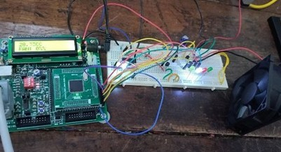

# ev-battery-thermal-management

# Thermal Management for EV Batteries

This project presents an embedded system designed to monitor and manage the temperature of electric vehicle (EV) batteries using an LPC1768 ARM Cortex-M3 microcontroller. It ensures safe operation by activating a cooling mechanism (DC fan) based on real-time temperature readings from an LM35 sensor.

---

##  System Overview

- **Microcontroller:** LPC1768 (ARM Cortex-M3)
- **Sensor:** LM35 (temperature sensor, 10mV/°C output)
- **Signal Conditioning:** LM324 op-amp amplifies signal for ADC input (0–3.3V)
- **Cooling Mechanism:** 12V DC fan controlled through GPIO and relay
- **User Interface:** LCD for temperature display, LEDs for status indication
- **Loads:** Two LEDs used to represent connected electrical loads

---

##  Cooling and Protection Logic

The system is designed to **gradually respond** to rising temperatures with both **cooling fan control** and **load shedding**, providing visual feedback:

| Temperature (°C) | Fan Speed | Load 1 | Load 2 | Indicator LED | System Behavior |
|------------------|-----------|--------|--------|----------------|------------------|
| 0–30             | OFF       | ON     | ON     | White          | Normal operation, no cooling needed |
| 31–33            | 33%       | ON     | ON     | Yellow         | Slight rise, fan activates moderately |
| 34–36            | 66%       | OFF    | ON     | Red            | Load shedding begins, increased cooling |
| >36              | 99%       | OFF    | OFF    | Green          | Maximum cooling, full load cut-off for protection |

---

##  Hardware Prototype

**Fig: Real-time embedded system prototype showing LPC1768 controller, LM35 sensor, LCD temperature display, active cooling fan, and LED indicators.**

- The LCD shows current temperature and fan speed.
- The fan (top-right) activates based on thresholds.
- LEDs on the breadboard simulate load control and temperature status.
##  Why Load Indication Was Used

**Loads (LEDs) were used not only for visual status but to simulate the real-world effect of cutting off power-consuming components when battery temperature rises.** This mimics the behavior of battery management systems (BMS) that reduce load to prevent further heating and stabilize temperature.

The staged disconnection of loads reflects:
- **Thermal protection strategy**
- **Power optimization under thermal stress**
- **Visual clarity for educational demonstration**

---

##  Key Features

- Automatic real-time thermal monitoring and response
- Incremental fan control with precision
- Load shedding logic based on temperature thresholds
- Compact prototype using standard embedded hardware components

---

## Why Real EV Batteries Were Not Used

**Due to safety concerns such as flammability, instability at high temperatures, and the risk of thermal runaway, actual lithium-ion EV batteries were not used in this prototype.** Instead, the thermal behavior was simulated using a soldering gun to heat the sensor, and loads (represented by LEDs) were used to mimic operational impact under different temperature levels. This allowed safe, controlled experimentation while demonstrating the system’s response.

---

## Applications

- Battery protection systems in electric vehicles
- Industrial and renewable energy systems requiring thermal safety
- Academic demonstration of sensor-based embedded control
